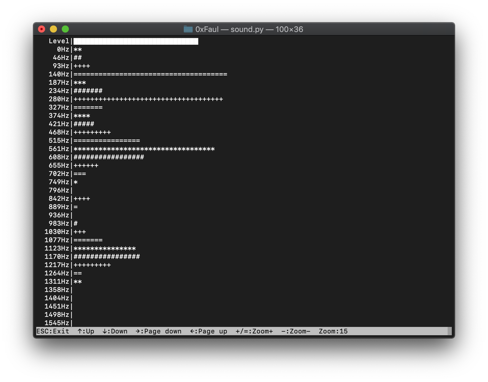

# Python Sound Visualizer
----
This program displays sound, amplitude and the different frequency ranges in your terminal window



## Requirements
* Python3
* PyAudio
* Numpy

## Installation

```
$ sudo apt-get update
$ sudo apt-get upgrade
$ sudo apt-get install python3 python3-pip python3-pyaudio
$ pip3 install numpy
```

## Usage
Open a terminal window, navigate to the downloaded files and type the following:
```
$ python3 sound.py
```
Then select an input device and choose a buffer size (the bigger the buffer, the smaller are the frequency ranges).

You can simply adjust the Amplitude with the '+' or '=' and '-' key on your keyboard or scroll to higher frequencies with the arrow keys or mouse wheel.

To exit the program simply press the 'ESC' key.

## Author
**Sebastian Faul** - [sebastian@faul.info](mailto:sebastian@faul.info)
